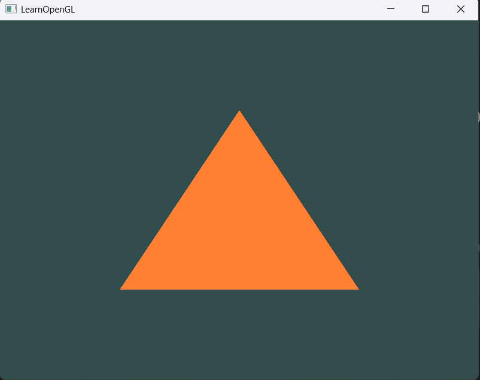

# OpenGL-CMake-Setup

A simple setup for OpenGL with CMake  
Specs:  
C++26  
Glad GL 4.6 core profile  

Docs and source code: [LearnOpenGL](https://learnopengl.com/)  

In main.cpp file exists an example for hello triangle

